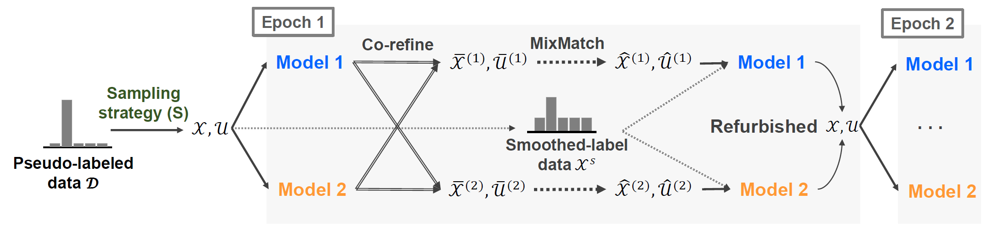
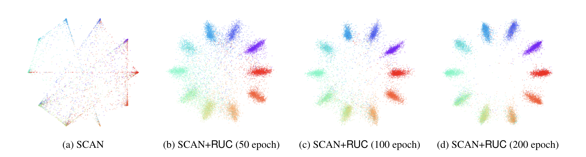

# Improving Unsupervised Image Clustering With Robust Learning #
This repo is the PyTorch codes for "Improving Unsupervised Image Clustering With Robust Learning (RUC)"
## Highlight ##
* Our proposed algorithm RUC aids existing unsupervised clustering models via retraining and helps to avoid overconfident predictions.
* The unique retraining process of RUC helps existing models outperform baselines. (STL-10 : 86.7%, CIFAR-10 : 90.3%, CIFAR-20 : 54.3%)
* The proposed training process can adjust the model confidence with better calibrations.

## Required packages ##
- python == 3.6.10
- pytorch == 1.1.0
- scikit-learn == 0.21.2
- scipy == 1.3.0
- numpy == 1.18.5
- pillow == 7.1.2

## Overall model architecture ##
<center> </center>

## Usage ##
```
usage: main_ruc_[dataset].py [-h] [--lr LR] [--momentum M] [--weight_decay W]
                         [--epochs EPOCHS] [--batch_size B] [--s_thr S_THR]
                         [--n_num N_NUM] [--o_model O_MODEL]
                         [--e_model E_MODEL] [--seed SEED]

config for RUC

optional arguments:
  -h, --help            show this help message and exit
  --lr LR               initial learning rate
  --momentum M          momentum
  --weight_decay        weight decay
  --epochs EPOCHS       max epoch per round. (default: 200)
  --batch_size B        training batch size
  --s_thr S_THR         confidence sampling threshold
  --n_num N_NUM         the number of neighbor for metric sampling
  --o_model O_MODEL     original model path
  --e_model E_MODEL     embedding model path
  --seed SEED           random seed
```

## Model ZOO ##
Currently, we support the pretrained model for our model. We used the pretrained SCAN and SimCLR model from SCAN github.
| Dataset           | Download link |
|-------------------|---------------| 
|CIFAR-10           | [Download](https://drive.google.com/file/d/16Wcby-8etsTPPIlsQb9oluk3NN8kSmCX/view?usp=sharing)  |
|CIFAR-20           | [Download](https://drive.google.com/file/d/118SIQ3YBx1y9Uoq-Wo3FyW9iYELKjcQJ/view?usp=sharing)  |
|STL-10             | [Download](https://drive.google.com/file/d/1mHLkC2JrKsnMswIeT6wKO4fV97DbTHtJ/view?usp=sharing)  |

## Experiment ##
We found that our algorithm can bring better calibrations than existing models.

